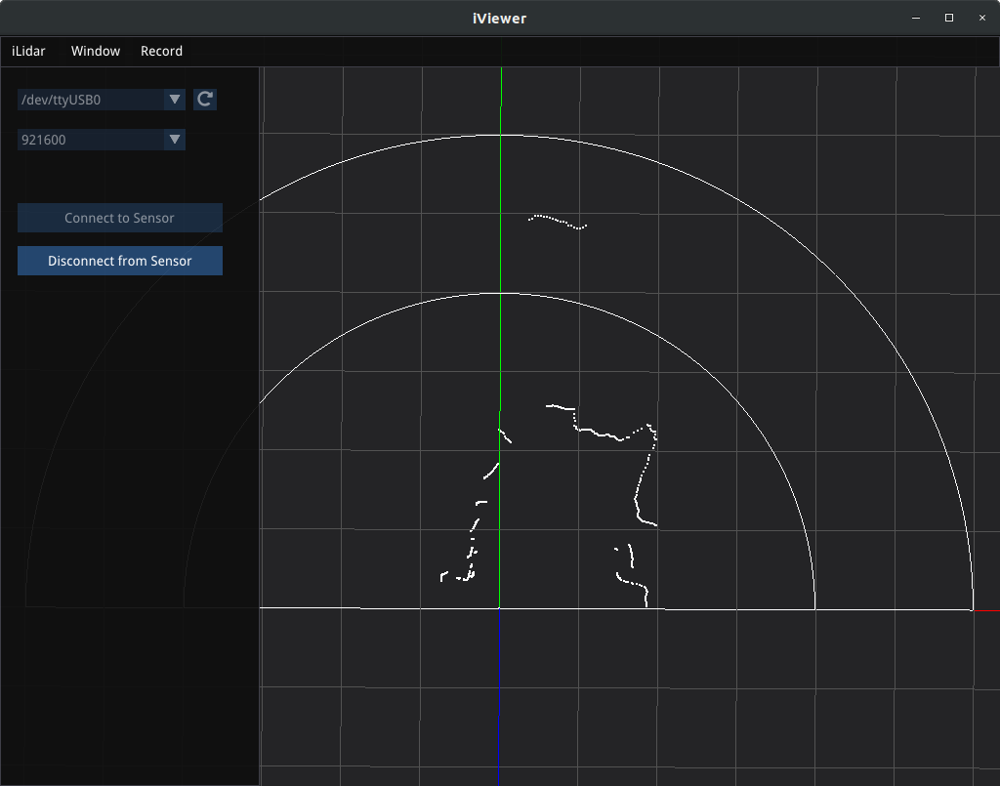
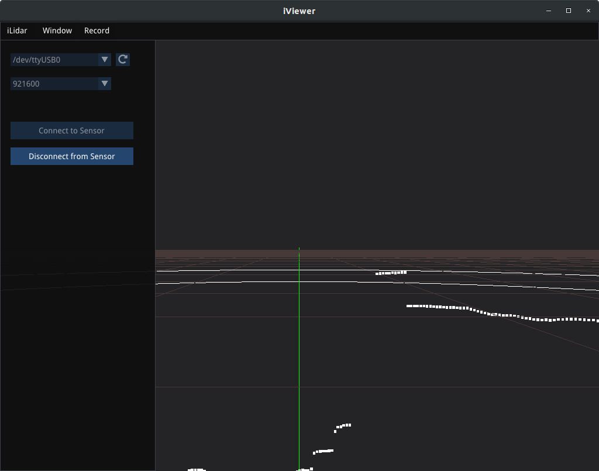
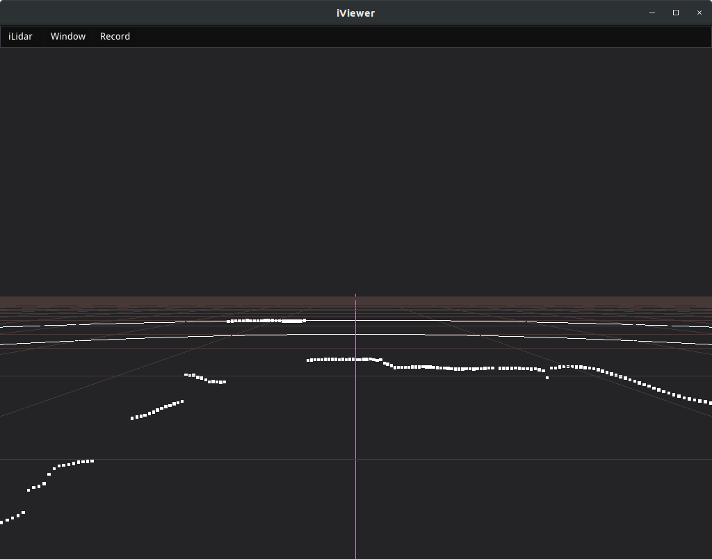
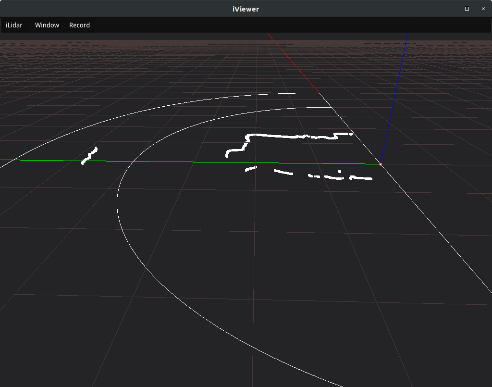
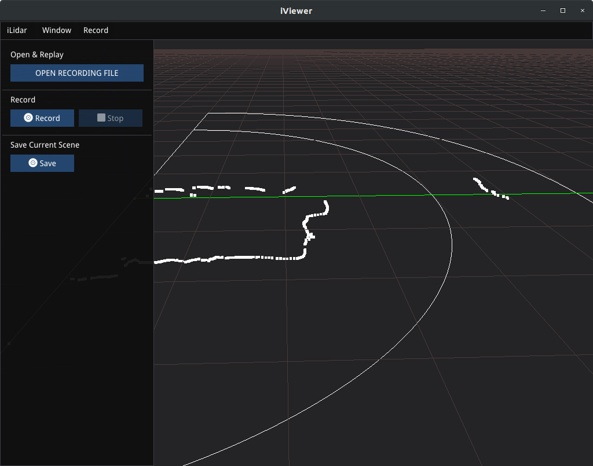
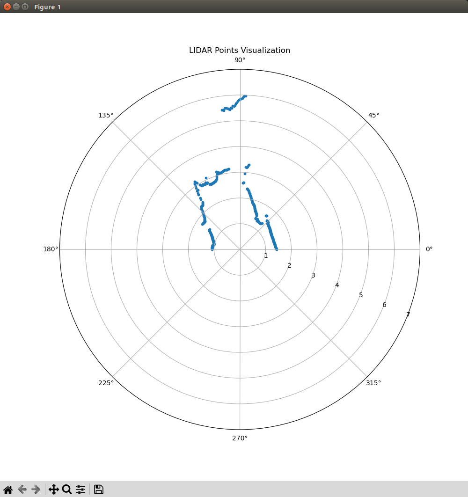

# hybo-ilidar-test
- [x] setting up &amp; testing hybo.co iLidar https://www.hybo.co/%EB%B3%B5%EC%A0%9C-product

on Ubuntu 18.04 LTS
- [x] [github](https://github.com/hybo-ilidar)

## 1 Installation

### [libglfw3](https://ubuntu.pkgs.org/18.04/ubuntu-universe-amd64/libglfw3-dev_3.2.1-1_amd64.deb.html)
```
# Update the package index:
sudo apt-get update
# Install libglfw3-dev deb package:
sudo apt-get install libglfw3-dev
```

### [libserialport0](https://ubuntu.pkgs.org/18.04/ubuntu-universe-amd64/libserialport0_0.1.1-2_amd64.deb.html)
```
# Update the package index:
sudo apt-get update
# Install libserialport0 deb package:
sudo apt-get install libserialport0
```

### [python bindings](https://github.com/Heavy02011/hybo)
```
pip install hybo
```


## 2 Identifying the iLidar on the USB port
```
dmesg | grep tty
```

ouput should show something like
```
[    0.000000] console [tty0] enabled
[    0.527507] 00:01: ttyS0 at I/O 0x3f8 (irq = 4, base_baud = 115200) is a 16550A
[  879.458032] usb 1-5: FTDI USB Serial Device converter now attached to ttyUSB0
```

just doing this out of curiosity
```
lsusb
```
getting:
```
Bus 001 Device 007: ID 0403:6015 Future Technology Devices International, Ltd Bridge(I2C/SPI/UART/FIFO)
```

## 3 Using iViewer version 0.2.1
```
chmod +x iViewer
./iViewer
```

### Setting up the connection
enter the USB port from above, set baud rate to *921600*, connect the sensor and have fun!


### Sample
first person view


left & right view



### Accuracy
Just measured the the distance to the wall and got *2.5m* (2.8m is the distance to the wall) in the imperfect environment of my room. Needs more testing...

### [Recordings](recordings)
Those need to be checked.

### [Coordinate System](https://github.com/hybo-ilidar/docs/blob/master/draft-hardware-user-interface-2020-02-21.md)

## fixes 
- if original repo was not forked
    ```
    git remote set-url origin [new_remote_repository_URL]
    ```
- run into error when visualizing (thx to gpt4!)

    needed fix in code installed by ```pip install hybo``` which is located ```python -c "import site; print(site.getsitepackages())"``` and actually located here: ```['/home/rainer/mambaforge/envs/donkey/lib/python3.9/site-packages/hybo/']```

## [examples](./examples/)

```
python examples/rbx-simple-vis.py
```